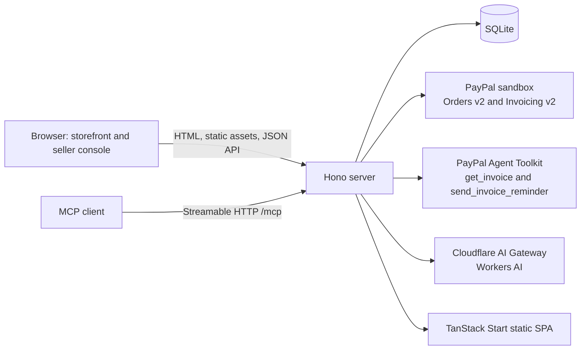

# ServiceReady

**Fixed-price service quotes for AI agents, PayPal deposits and invoices, and seller-approved collections nudges.**

**Live demo:** [serviceready.fly.dev](https://serviceready.fly.dev)

**PayPal sandbox only — no real money is moved.**

## Try it in 3 minutes

1. Open [`/s/maya-rao-studio`](https://serviceready.fly.dev/s/maya-rao-studio). Ask the in-page agent for a logo quote; it needs your name, email, and project brief. Or choose **Request quote** on the Logo design service.
2. Open the quote link and pay its deposit with a PayPal sandbox personal account: **`SANDBOX_BUYER_EMAIL` / password: see Devpost “Testing instructions”.** Sandbox card guest checkout is also available through the card button.
3. Open [`/app`](https://serviceready.fly.dev/app), open the booking, and choose **Mark delivered & send balance invoice**.
4. In the booking’s **Paste client reply** box, enter `I already paid` and send it to the agent. The collections agent checks the invoice with PayPal’s `get_invoice` tool and records a proposal.
5. Open [`/app/approvals`](https://serviceready.fly.dev/app/approvals) and review the proposal. If it is a `send_reminder` action, approve it to run PayPal Toolkit’s `send_invoice_reminder`. If PayPal confirms the invoice is paid, the server forces a `thank_and_close` action instead.
6. Explore the friendly collections dashboard at [`/app/collections`](https://serviceready.fly.dev/app/collections) and the audit log at [`/app/log`](https://serviceready.fly.dev/app/log).
7. Reset the single-seller demo data with:

   ```sh
   curl -X POST https://serviceready.fly.dev/api/demo/reset
   ```

   This wipes and reseeds the demo’s application data. Development-only sample quotes can be seeded with `POST /api/demo/reset?with_samples=1`.

## Connect an AI agent with MCP

The stateless Streamable HTTP endpoint is [`https://serviceready.fly.dev/mcp`](https://serviceready.fly.dev/mcp). It exposes four tools:

- `list_services`
- `get_service`
- `request_quote`
- `get_quote_status`

For Claude Desktop, add this to its MCP server configuration:

```json
{
  "mcpServers": {
    "serviceready": {
      "command": "npx",
      "args": ["-y", "mcp-remote", "https://serviceready.fly.dev/mcp"]
    }
  }
}
```

To inspect the remote tools with MCP Inspector:

```sh
npx -y @modelcontextprotocol/inspector --cli \
  https://serviceready.fly.dev/mcp --method tools/list
```

Agents can discover services, request quotes, and check quote status. They cannot pay: `request_quote` returns an approval URL, and a human must approve and pay the deposit.

## How PayPal is used

- **Deposit — Orders v2:** The server creates an order with `intent: CAPTURE`; both `reference_id` and `custom_id` identify the quote. `PayPal-Request-Id` makes order creation idempotent. The server captures the order and accepts a deposit only after validating the completed capture, quote ID, currency, and exact deposit amount.
- **Balance — Invoicing v2:** After the seller marks work delivered, the server creates and sends a USD balance invoice. Its payer link is stored with the quote’s balance payment. Partial payments were rejected for this PayPal account with: **“Partial payments are not available in your country”**. The deposit and balance are therefore separate payments.
- **Webhooks:** `/api/paypal/webhook` verifies signatures through PayPal’s `verify-webhook-signature` API and deduplicates event IDs. On `INVOICING.INVOICE.PAID`, the server fetches the invoice again and only accepts payment when PayPal reports it paid. In sandbox testing PayPal delivered `PAYMENT.CAPTURE.COMPLETED` but we did not observe an `INVOICING.INVOICE.PAID` delivery, so **Refresh from PayPal** and the collections agent re-read the invoice directly from PayPal; either path marks it paid.
- **Browser checkout:** The quote page uses PayPal’s JavaScript SDK buttons in USD with capture intent. PayPal and card funding are available; Pay Later is disabled.
- **Collections tools:** PayPal Agent Toolkit **1.11.0** is configured for `get_invoice` and `send_invoice_reminder`. The collections agent checks invoice status before proposing an action; the reminder tool runs only after seller approval.

All payment API calls use PayPal’s sandbox host, `api-m.sandbox.paypal.com`.

## How AI is used

Requests go through the **Cloudflare AI Gateway** to Workers AI using the OpenAI-compatible chat-completions API. The primary model is `workers-ai/@cf/openai/gpt-oss-120b`; after one retry, failures fall back to `workers-ai/@cf/meta/llama-3.3-70b-instruct-fp8-fast`.

| Role | What it does |
| --- | --- |
| Catalog parser | Extracts service packages with a strict `submit_services` tool schema. Code validates prices and computes warnings. |
| Quote scope writer | Produces scope and fit-check text with a strict schema; a template is used if the model fails. |
| Client agent simulator | Helps a client explore services and request a quote. It asks for name, email, and brief first, and cannot pay. |
| Collections agent | Uses PayPal `get_invoice` and a local `propose_action` tool to record a seller-reviewable action. The server fetches the invoice itself if the model omits the check. |
| AG Studio Nudge-bot | Lists open balances and checks PayPal before drafting a friendly nudge. Its proposal waits in `/app/approvals`; it does not send anything itself. Requires an AG Studio license key to activate. |

**AI never sets prices or payment amounts.** The server computes total, deposit, and balance with [`calculateQuoteAmounts`](server/src/core.ts); PayPal receives those code-computed amounts.

## Safety and human-in-the-loop

- A quote uses the published service price. An agent cannot capture a deposit or send a collection reminder.
- The seller reviews and approves a pending collections proposal. Only an approved `send_reminder` calls the PayPal reminder tool.
- Events record agent/tool activity, PayPal events, decisions, replies, and seller approvals; the seller can inspect them at `/app/log`.
- AI endpoints have an in-memory limit of **20 requests per minute per IP address**. This covers catalog parsing, public quote creation, collection runs and replies, agent simulation, and the Studio LLM proxy.
- PayPal client secrets and Cloudflare API tokens stay on the server. The browser receives the PayPal client ID, which is a public identifier. The optional Studio license key is a build-time browser setting, not a server credential.

## Architecture



The Hono server serves the built SPA from `web/dist/client`, the JSON API, and `/mcp`.

### Repository layout

```text
server/
  src/       Hono API, SQLite store, PayPal and AI services, MCP tools
  scripts/   PayPal webhook registration
  test/      backend unit tests and opt-in sandbox tests
web/
  src/
    components/  storefront, seller console, PayPal and AG Studio widgets
    lib/         API client, types, mock data and Studio AI adapter
    routes/      TanStack SPA pages
```

## Run locally

Use **Node.js 20** and npm. Export the required credentials in your shell before running the server or live tests. Do not commit credentials.

| Variable | Required | Where it comes from |
| --- | --- | --- |
| `PAYPAL_CLIENT_ID` | Yes for PayPal | PayPal Developer Dashboard, sandbox app credentials |
| `PAYPAL_CLIENT_SECRET` | Yes for PayPal | PayPal Developer Dashboard, sandbox app credentials; server only |
| `CLOUDFLARE_ACCOUNT_ID` | Yes for AI | Cloudflare account dashboard |
| `CLOUDFLARE_API_TOKEN` | Yes for AI | Cloudflare API token with access for the configured AI Gateway / Workers AI; server only |
| `PAYPAL_WEBHOOK_ID` | Needed to verify deployed webhooks | PayPal webhook registration output or PayPal Developer Dashboard |
| `DATABASE_PATH` | Optional | Local SQLite file path; defaults to `./data/dev.db` |
| `PUBLIC_BASE_URL` | Optional | Public server URL used in quote and MCP links; defaults to `http://localhost:8080` |
| `AI_GATEWAY` | Optional | Cloudflare AI Gateway name; defaults to `paypal-hackathon` |
| `PORT` | Optional | HTTP listen port; defaults to `8080` |
| `WEB_DIST` | Optional | Static client directory; defaults to `web/dist/client` |
| `ALLOW_DEMO_SAMPLES` | Optional | Set to `1` to allow sample quotes in production; otherwise production sample seeding is denied |
| `VITE_USE_MOCKS` | Web build setting | `false` for the real API; `web/.env.production` sets this for production builds. Web development defaults to mocks. |
| `VITE_AG_STUDIO_LICENSE_KEY` | Optional, build time | AG Grid / AG Studio license or trial; never commit the key |

Build and start the static web client with the server:

```sh
npm ci
npm --prefix web ci
npm run build:web
npm run build
npm start
```

For development, `npm run dev` watches and runs the Hono server. In another terminal, `npm --prefix web run dev` starts the frontend with mock data by default.

Tests:

```sh
npm test
LIVE=1 npm test
(cd web && npx tsc --noEmit)     # web TypeScript check
npm --prefix web test
```

`LIVE=1 npm test` uses the configured PayPal sandbox and Cloudflare AI Gateway. It creates an uncaptured sandbox order, sends and cancels a test invoice, exercises AI, and attempts cleanup.

## Deploy to Fly.io

`fly.toml` configures the `serviceready` app, port `8080`, `/api/health`, and the `serviceready_data` volume mounted at `/data`.

Create the volume once, import secrets from a local **uncommitted** environment file, and deploy:

```sh
flyctl volumes create serviceready_data --region iad --size 1 --app serviceready
flyctl secrets import --app serviceready < .env.fly
flyctl deploy --app serviceready
```

Register the PayPal sandbox webhook from a machine with the sandbox client credentials in its environment:

```sh
npx tsx server/scripts/register-webhook.ts \
  https://serviceready.fly.dev/api/paypal/webhook
```

The script prints the webhook ID. Add that value as `PAYPAL_WEBHOOK_ID` in the local secrets file and import it to Fly. The registered events are `PAYMENT.CAPTURE.COMPLETED`, `INVOICING.INVOICE.PAID`, and `INVOICING.INVOICE.CANCELLED`.

## AG Studio license

Set `VITE_AG_STUDIO_LICENSE_KEY` in the web build environment to enable the Studio AI assistant and custom Nudge-bot. Without a key, the collections page keeps its dashboard widgets, AG Studio displays its watermark, and the page shows a muted note that the AI assistant requires a license. Do not commit the key.

## Known limitations

- This is a single-seller demo seeded for Maya Rao Studio; it is not a multi-tenant service.
- USD and the PayPal sandbox are hardcoded. No real-money transaction is supported.
- **WebMCP is not implemented.** The storefront lists the proposed tools and checks whether `navigator.modelContext` exists, but the code does not register tools with that browser API. Use the working `/mcp` endpoint for agent access.
- The demo has no seller authentication. `POST /api/demo/reset` is unauthenticated and resets the single-seller application data; do not use this prototype for private production data.
- **Dependency audit.** `npm audit --omit=dev` reports 9 remaining advisories (4 high, 2 moderate, 3 low), all inside `@paypal/agent-toolkit@1.11.0` (the latest release). npm's only suggested fix is a downgrade to 1.3.5, which we don't take. ServiceReady imports only `@paypal/agent-toolkit/openai`; at runtime that entry point loads `mathjs` but none of the flagged packages (`@langchain/core`, `langsmith`, `ai`, `@ai-sdk/*`, `jsondiffpatch`, the toolkit's `uuid`). We pin `mathjs` to 15.2.0 through `overrides`, which clears its advisory. The toolkit only calls `mathjs.round`.

## License

MIT. See [`LICENSE`](LICENSE).
